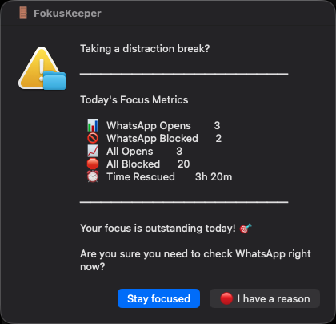

# FokusKeeper

A macOS distraction gate. Opening Slack, YouTube, or eight other time sinks costs you one deliberate click first.



## What it does

FokusKeeper watches your frontmost app. When you open a gated app or switch a browser tab to a gated site, it blocks the surface (quits the app, or parks the tab at `about:blank`) and shows a dialog with today's numbers: opens, blocks, time rescued, and a motivation line.

Two buttons:

- **Stay focused** (default): the app stays quit or the tab closes, and your prevented-distraction count goes up.
- **I have a reason**: the app relaunches or the tab restores to its exact URL, and you get a cooldown (3 minutes by default, adjustable) with no further prompts.

That is the whole product. It is a speed bump, not a wall. Most distraction checks are reflexes; making the reflex cost one conscious decision is enough to kill a large share of them, and the dialog shows you the running score.

## Download

[**Download FokusKeeper**](https://github.com/cipshadow/fokuskeeper/releases/latest/download/FokusKeeper-Install.zip)

Unzip it, then double-click `FokusKeeper-Install.command`. A Terminal window opens itself, downloads the app, and installs it -- no typing required.

Since this isn't a signed app, macOS will likely block it the first time with no direct "Open" option. If that happens: go to **System Settings -> Privacy & Security**, scroll down to the blocked-item notice near the bottom, click **Open Anyway**, then double-click the file again and confirm once more. One-time only.

Prefer git? See [Manual install](#install) below.

## Apps

| App or site | Native app | Web (Chrome, Safari) |
|---|---|---|
| Slack | Slack | app.slack.com |
| Gmail | - | mail.google.com |
| WhatsApp | WhatsApp | web.whatsapp.com |
| Instagram | - | instagram.com |
| Facebook | - | facebook.com |
| Reddit | - | reddit.com |
| YouTube | - | youtube.com |
| X | - | x.com, twitter.com |
| TikTok | - | tiktok.com |
| LinkedIn | - | linkedin.com |

You pick which of these to gate at first run; all ten are pre-selected. Firefox isn't supported — it has no AppleScript support for reading tab URLs, so there's no reliable way to gate it (see the FAQ).

## How it works

A Python daemon (`fokuskeeper.py`, stdlib only) polls the frontmost application every 0.5 seconds via `osascript`. When Chrome or Safari is frontmost it also reads the active tab's URL. Detection is edge-triggered: an app prompts when you switch to it, not continuously while you stay on it.

On each detected open, the gate decides in strict precedence order:

1. **Cooldown**: within the cooldown window (default 3 minutes) of a grant, allow silently.
2. **First open of the day**: auto-allow (you get one free check).
3. **Quiet period**: no use of that app in the quiet-period window (default 60 minutes), auto-allow.
4. **Prompt**: block the surface and show the dialog.

Cooldowns are shared per app across surfaces: allowing the Slack app also covers app.slack.com in your browser for the same window. The cooldown clock is fixed at the moment of the grant; continued use does not extend it. Both windows are adjustable -- see **Customization** below.

## Prerequisites

- macOS 12 or later
- Python 3.9+ (stdlib only for the daemon itself; the system `python3` works). A fresh Mac without developer tools will offer to install the Xcode Command Line Tools the first time you run `python3`; accept that, or `brew install python`.
- Google Chrome and/or Safari, if you want web gating (the app surfaces work without either)
- Internet access during install, to fetch `rumps` for the menu bar icon (see below — the daemon still works fine without it)

## Install

```bash
git clone https://github.com/cipshadow/fokuskeeper.git
cd fokuskeeper
./install.sh
```

The installer checks for `python3`, sets up a menu bar icon (a small `.venv` with `rumps`), builds `~/Applications/FokusKeeper.app` as the login launcher, and starts everything. Add the app to System Settings -> General -> Login Items to start it at login. Pass `--with-control-panel` to also get a `FOKUSKEEPER.command` start/stop/stats panel on your Desktop.

If the menu bar setup can't complete (no network, or no build tools for one of its dependencies), install continues anyway with a plain headless daemon — no menu bar icon, but gating still works fully. Retry the menu bar setup any time with `python3 -m venv .venv && .venv/bin/pip install -r requirements.txt && ./start-menubar.sh`, then re-run `./install.sh` to regenerate the login launcher so it picks it up automatically.

On first run a short welcome screen explains how the dialog and cooldown work, then a native chooser lists all ten apps, pre-selected (deselect any you want ungated), followed by two prompts for the cooldown and quiet-period minutes. Your choices are saved to `~/.fokuskeeper-config.json`. Change any of it again any time from the menu bar icon's **Settings...** menu item.

### Permissions

macOS asks for **Automation** permission the first time FokusKeeper talks to System Events (frontmost-app polling), Google Chrome, and Safari (tab reading) -- each browser is a separate grant, only asked for the ones you actually use. Click Allow.

Grants are **per launching app**: the daemon started from your terminal and the daemon started by FokusKeeper.app each need their own grant. If web gating stops silently after you switch how the daemon starts, run `./fokuskeeper logs` and look for a `WARNING: Cannot read ... tabs` line, then re-grant Automation for that browser to the launching app in System Settings -> Privacy & Security -> Automation.

## Usage

```bash
./fokuskeeper start      # start the daemon
./fokuskeeper stop       # stop it
./fokuskeeper restart    # stop + start
./fokuskeeper status     # daemon liveness plus today's stats
./fokuskeeper logs       # last 20 log lines
./fokuskeeper stats      # today's per-app numbers
./fokuskeeper history    # last 7 days, grouped by date
./fokuskeeper report     # all-time totals
./fokuskeeper reset      # zero today's counters (cooldowns survive)
./fokuskeeper settings   # choose apps, adjust cooldown / quiet-period minutes
```

Sample `stats` output:

```
FokusKeeper - Today's stats (2026-08-30)
  Slack: opens 3, blocked 2, cooldown none
  Gmail: opens 1, blocked 0, cooldown 2m left
  ...
  Total opens: 4
  Total blocked: 2
```

## Customization

- **Apps and timing**: click **Settings...** in the menu bar icon's menu, or run `./fokuskeeper settings` from a terminal -- both walk through the same three prompts: which apps to gate, cooldown minutes, and quiet-period minutes (1-1440 each), pre-filled with your current values. Cancelling the app chooser just skips that step; cancelling either timing prompt skips both timing settings together, leaving your existing cooldown/quiet-period values as they were. Changes apply live; the daemon watches the config file's mtime, no restart needed.
- **Menu bar icon**: installed by default (see Install above). A shield-with-K icon shows daemon state; click it to start/stop. To start it manually without logging out and back in, run `./start-menubar.sh` — it prefers the repo's `.venv` automatically and starts the daemon itself if it isn't already running.

## Uninstall

```bash
./uninstall.sh           # stop everything, remove the launcher app and Desktop panel
./uninstall.sh --purge   # also delete state, history, config, and logs
```

`--purge` also removes leftover files from the legacy naming (`~/.slack-gatekeeper-state.json` and friends). Removing the Login Items entry is a manual step; the script tells you where.

## FAQ

**Which browsers are gated?**
Google Chrome and Safari. Arc is Chromium-based but untested; Firefox can't be supported the same way -- it has no AppleScript dictionary support for reading a tab's URL, so there's no reliable way to detect what site is open. Native app gating (Slack, WhatsApp) works regardless of browser.

**Does restoring an allowed tab work the same way in both browsers?**
Almost. Chrome exposes a stable numeric id per tab, so a restore always lands on the exact tab even if you've opened others in that window meanwhile. Safari's scripting support has no per-tab id -- only a window id -- so FokusKeeper restores to "whatever tab is current in that window" instead. In practice this only differs if you switch to a different tab in that same window during the second or so the dialog takes to appear.

**Why only app.slack.com and not all of slack.com?**
Matching all of slack.com would also gate sign-in and marketing pages, and the sign-in flow would get you prompted twice on the way into the app. The hostname match is deliberate.

**I opened two distractions at once and only got one dialog.**
While a dialog is up the poll loop is paused, so a second app opened meanwhile is missed. It gets caught on its next focus change.

**Where does my data go?**
Nowhere. State, history, and config live in your home directory (`~/.fokuskeeper-state.json`, `~/.fokuskeeper-history.json`, `~/.fokuskeeper-config.json`), the log in `~/Library/Logs/fokuskeeper.log`, all with `chmod 600`. No telemetry, no network calls.

**Can I bypass it?**
Yes, trivially: stop the daemon, or click the allow button. FokusKeeper is a mindfulness speed bump for yourself, not parental controls. If you can bypass it without noticing you did, that is the moment it was built for.

**What does 0.5-second polling cost?**
One short `osascript` call per tick (two while a supported browser is frontmost). CPU use is negligible on any modern Mac.

**What happens if I press Return while the dialog is focused?**
"Stay focused" is the default button, so Return blocks. Reflex-smashing the keyboard lands on the safe side; allowing requires clicking the other button.

**I upgraded from the old version. Where are my stats?**
Legacy `~/.slack-gatekeeper-*.json` files are copied to the new names automatically on first run; the originals stay in place as rollback.

**I can't find the menu bar icon.**
The daemon and gating still work either way -- the icon is a convenience, not a dependency. If you run a menu bar organizer (Bartender, Ice, and similar), check its hidden/overflow section first; some are configured to auto-hide inactive icons. Either way, `./fokuskeeper start|stop|status` from a terminal always works regardless of icon visibility.

## License

MIT. See [LICENSE](LICENSE).
